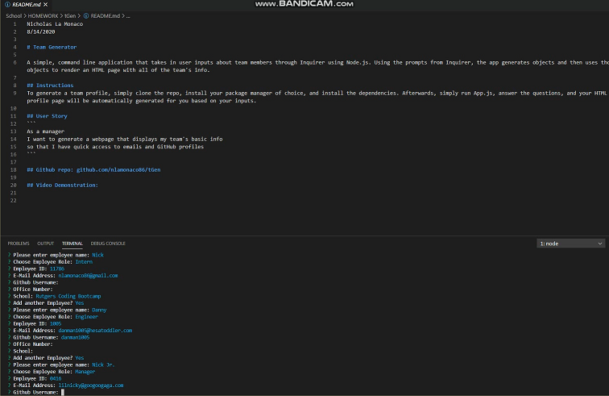

Nicholas La Monaco
8/14/2020

# Team Generator

A simple, command line application that takes in user inputs about team members through Inquirer using Node.js. Using the prompts from Inquirer, the app generates objects and then uses those objects to render an HTML page with all of the team's info.   

## Instructions
To generate a team profile, simply clone the repo, install your package manager of choice, and install the dependencies. Afterwards, simply run App.js, answer the questions, and your HTML profile page will be automatically generated for you based on your inputs.

## User Story
```
As a manager
I want to generate a webpage that displays my team's basic info
so that I have quick access to emails and GitHub profiles
```

## Github repo: 
http://www.github.com/nlamonaco86/tGen

## Video Demo:
https://github.com/nlamonaco86/tGen/raw/master/tGenDEMO.avi



